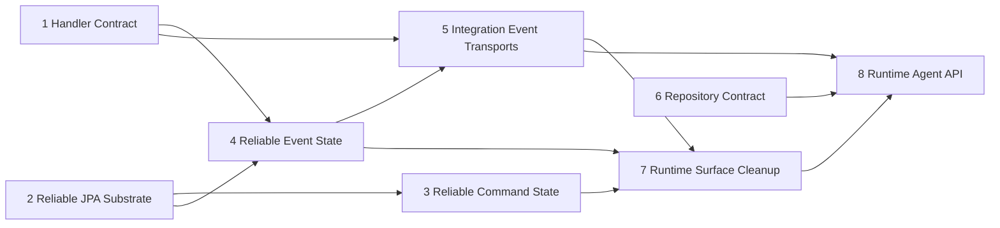

# Runtime completed capability index

## Status and purpose

Status: Runtime Batches 1-4 and the Repository Contract, Surface Cleanup, and Runtime Agent API facts
are complete on `master` through PR #183.

This document is the durable completed-capability index for the audited Runtime redesign. It records
the landed dependency order, fixed contracts, implementation owners, and remaining evidence limits so
later work does not reconstruct current Runtime facts from historical conversations or pending-roadmap
language.

No remaining Runtime behavior implementation is authorized by this index. The only immediate Runtime
follow-up is canonical documentation closure. Live database, broker, multi-process, process-crash, and
external-side-effect/ack-window evidence remains explicitly `NOT_PERFORMED` and belongs to later real-
project or provider verification.

The Runtime capability audit must be closed before Analyzer modification or downstream end-to-end
validation begins. Once this canonical closure is merged, the external evidence gaps do not by
themselves block the independent Analyzer capability audit.

## Fixed decisions

- Breaking iteration is allowed; no external-user compatibility bridge is required.
- Handler methods are synchronous. “Async” means only that a `Mediator` operation is scheduled
  (`enqueue`, `schedule`, or `delay`); handlers do not escape their invocation scope.
- `@EventListener` is the only public event-handler contract. `EventSubscriber<T>` and other retired
  subscriber entry points are removed.
- A handler completes only after all async Query/Capability work started in its scope completes;
  failures propagate to the handler result. `condition` and `@Order` are supported, but event
  consumption order is not a cross-consumer reliability guarantee.
- Reliable records are at-least-once. State transitions, retry, claim, lease, redrive, retention, and
  acknowledgement semantics remain Runtime-owned and are not exposed as a generic task framework.
- Reliable event payloads reject persisted `Aggregate`, `Entity`, or other persistence-bound entity
  instances. This boundary must not be weakened by generators or transports.
- Runtime JSON uses the shared Jackson boundary from `runtime-jackson-only`; no FastJSON/Gson fallback
  or compatibility alias exists.
- HTTP is an experience transport with static `routes[eventName] -> baseUrl`, fixed receive endpoint,
  and self-routing. It is not a production-grade broker and has no subscriber registry or JPA surface.
- One application has at most one active outbound Integration Event transport provider.
- `RuntimeProviderStateRegistry` is the sole current live provider-state source. No Actuator endpoint
  currently exists. A future optional endpoint may only read and project `snapshot()` directly; it
  cannot cache, merge, derive, or become a second state source.

## Completed baseline

| Capability | Landed evidence |
| --- | --- |
| Handler completion contract | PR #158, `runtime-handler-contract` |
| Console retirement | PR #159, `runtime-console-retirement` |
| Pipeline Jackson migration (adjacent infrastructure) | PR #160, `pipeline-jackson-only` |
| Reliable event delivery context | PR #161, `reliable-event-delivery-context` |
| Snowflake retirement | PR #162, `runtime-snowflake-retirement` |
| Generated repository adapter boundary | PR #163, `generated-repository-adapter-boundary` |
| Runtime Jackson-only contract | PR #164, `runtime-jackson-only` |
| Runtime follow-up contract index | PR #165, original `runtime-roadmap` slice |
| Retired Runtime Agent descriptors | PR #166, `runtime-agent-retired-descriptors` |
| Reliable retry-policy snapshot | PR #167, `runtime-retry-policy-snapshot` |
| Strict provider composition | PR #168, `runtime-provider-composition` |
| Safe failure facts and result/archive removal | PR #169, `runtime-safe-failure-result-repository` |
| JPA atomic claim/token/lease/renewal | PR #170, `runtime-jpa-atomic-claim-lease` |
| Reliable Command state machine | PR #171, `runtime-reliable-command-state` |
| Reliable Event JPA coordinator | PR #172, `runtime-reliable-event-state` |
| Bounded retention cleanup | PR #173, `runtime-retention-cleanup` |
| Manual redrive | PR #174, `runtime-manual-redrive` |
| Integration Event envelope and once-only completion | PR #175, `runtime-integration-event-core` |
| Batch 4 transport contract closure | PR #176, documentation contract |
| Shared transport foundation | PR #177, `runtime-shared-transport-foundation` |
| RocketMQ transport | PR #178, `runtime-rocketmq-transport` |
| HTTP experience transport reset | PR #179, `runtime-http-experience-reset` |
| RabbitMQ transport | PR #180, `runtime-rabbitmq-transport` |
| Locker/runtime surface retirement | PR #181, `runtime-surface-cleanup` |
| Runtime Repository contract | PR #182, `runtime-repository-contract` |
| Runtime Agent API facts | PR #183, `runtime-agent-api-facts` |

## Landed dependency graph

The graph records the semantic landing order. Repository work remained the independent carrier and
registration exception. All eight bounded contracts are now complete.

## Eight completed bounded contracts

### 1. Handler contract — PR #158

`@EventListener` is the sole public event Handler shape. Runtime supports Spring `condition` and local
`@Order`, rejects retired subscriber APIs and escaping Handler forms, and joins all Runtime-managed
async Query/Capability stages before local Handler completion.

### 2. Reliable JPA substrate — PRs #167, #169, and #170

The internal reliable execution substrate owns retry-policy snapshots, safe failure facts, atomic
claim, delivery token, lease ownership/renewal, and retention hooks. It is not a public scheduler,
job framework, generic task queue, or result/archive repository.

### 3. Reliable Command state — PR #171

Reliable Command persistence uses one state machine and the shared JPA substrate. Public invocation
remains the existing `Mediator.commands` synchronous and enqueue/schedule/delay operations. Result
polling, archive, Locker, and legacy scheduling bypasses are absent.

### 4. Reliable Event state — PR #172

Persisted Domain Events and outbound Integration Events use the shared JPA coordinator and reliable
state machine. Public outbound Integration Event registration is only
`Mediator.events.enqueue/schedule/delay`. Reliable payload entity rejection remains mandatory.

`DomainEventSupervisor.attach/detach` is a separate Domain Event/UoW model and remains valid. Provider
interceptor attachment/pre-persist hooks are internal route-registration and validation details, not
public Integration Event attach APIs.

### 5. Integration Event transport — PRs #175-#180

One selected provider receives an outbound reliable Event. HTTP uses static routes and self-routing;
RabbitMQ and RocketMQ use explicit provider routes. Provider confirmation and inbound acknowledgement
follow their canonical child specs. The sender does not enumerate consumers, and each consumer owns
its local Handler completion and retry boundary.

The shared foundation removed public subscriber identity, HTTP dynamic subscriber registration,
subscriber capabilities, subscriber JPA carrier/table, and any second route model. Inbound
subscriptions derive from real local `@EventListener` Integration Event methods.

### 6. Repository contract — PR #182

The JPA carrier remains private. Duplicate registration fails deterministically. `JpaPredicate`,
sorting, paging, `PageData`, repository discovery, and generated adapter ownership follow
`runtime-repository-contract`.

### 7. Runtime surface cleanup — PR #181

Locker, Snowflake, Saga, Console, HTTP-JPA, retired result/archive repositories, old modules, starters,
configuration, SQL, and documentation claims are removed from current Runtime surfaces. Runtime JSON
remains Jackson-only.

### 8. Runtime Agent API facts — PR #183

The Gradle-first static `runtime.json` publishes deterministic capability and provider declarations.
Static facts never probe external systems and keep assembly/state `UNKNOWN` and
observation/verification `NOT_PERFORMED`. Live provider state is owned only by
`RuntimeProviderStateRegistry`.

No current Actuator endpoint exists. Any future optional projection must delegate each read directly
to the registry snapshot and must not become a second state source.

## Completed implementation batches

- Batch 1 established Handler, retirement, delivery-context, repository-adapter, and Jackson
  foundations through PR #164.
- Batch 2 completed strict provider composition, retry snapshots, safe failure facts, retired Agent
  descriptor policy, and result/archive removal through PR #169.
- Batch 3 completed JPA claim/lease, Command and Event coordinators, retention, redrive, and Integration
  Event core through PR #175.
- Batch 4 completed the shared transport foundation and HTTP, RabbitMQ, and RocketMQ providers through
  PR #180.
- Final Runtime closure completed Surface Cleanup, Repository Contract, and Agent API facts through
  PR #183.

## Non-goals that remain closed

- No generic task/scheduler framework.
- No second event Handler API or public `EventSubscriber<T>` compatibility bridge.
- No event-consumer global ordering guarantee.
- No Runtime projection/read-model API, `Mediator.prj`, or provider-specific query abstraction.
- No restoration of Locker, Snowflake, Saga, Console, HTTP-JPA, result/archive, subscriber registry,
  or old repository public surfaces.
- No automatic Analyzer-to-Generator feedback loop.
- No changes to strategic-domain responsibility or business-decision ownership.

## Current automated evidence

The current Runtime closure is accepted only with focused owner tests, the Runtime stale-surface and
current-fact guard, repository `check`, and `git diff --check`. Static Agent facts must continue to
report unexecuted operational evidence as `NOT_PERFORMED` or `UNKNOWN` rather than inferring success.

## External evidence gaps

The following evidence is not part of the completed in-repository implementation proof and remains
`NOT_PERFORMED` until a dedicated real environment supplies it:

- real MySQL and PostgreSQL claim/lease/renewal/retention execution;
- live RabbitMQ broker confirmation, acknowledgement, reconnect, redelivery, and failure behavior;
- live RocketMQ nameserver/broker send-result, consumption, reconnect, and retry behavior;
- multi-process long-running claim/lease soak;
- real process crash and lease reclaim;
- external side effect success followed by process loss before durable acknowledgement.

These gaps are later real-project, database-dialect, and provider-operational validation. They must
not be written as passed, but they do not reopen the landed Runtime contracts or block the independent
Analyzer capability audit after this canonical documentation closure is merged.
