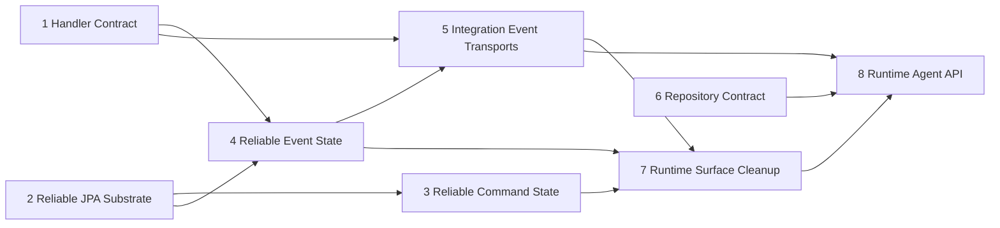

# Runtime follow-up roadmap

## Status and purpose

Status: Proposed roadmap, based on the confirmed Runtime target contract.

This document is the durable index for the remaining Runtime implementation. It records the
branch boundaries, dependency order, parallel batches, and acceptance evidence so that later
implementation sessions do not have to reconstruct the plan from conversation history.

The roadmap is intentionally Runtime-only. Generator and Analyzer work wait until the Runtime
contracts are implemented and re-audited.

## Fixed decisions

- Breaking iteration is allowed; no external-user compatibility bridge is required.
- Handler methods are synchronous. “Async” means only that a `Mediator` operation is scheduled
  (`enqueue`, `schedule`, or `delay`); handlers do not escape their invocation scope.
- `@EventListener` is the only public event-handler contract. `EventSubscriber<T>` and other
  retired subscriber entry points are removed.
- A handler completes only after all async query/capability work started in its scope completes;
  failures propagate to the handler result. `condition` and `@Order` are supported, but event
  consumption order is not a cross-consumer reliability guarantee.
- Reliable records are at-least-once. State transitions, retry, claim, lease, redrive, retention,
  and acknowledgement semantics remain Runtime-owned and are not exposed as a generic task
  framework.
- Reliable event payloads reject persisted `Aggregate`, `Entity`, or other persistence-bound
  entity instances. This boundary must not be weakened by generators or transports.
- Runtime JSON uses the shared Jackson boundary from `runtime-jackson-only`; no FastJSON/Gson
  fallback or compatibility alias is added.
- HTTP is an experience transport with static routes. It is not a production-grade broker and does
  not gain a second routing/configuration model.

## Current baseline

Merged before this roadmap:

| Capability | Evidence |
| --- | --- |
| Handler completion contract | PR #158, `runtime-handler-contract` |
| Console retirement | PR #159, `runtime-console-retirement` |
| Pipeline Jackson migration | PR #160, `pipeline-jackson-only` |
| Reliable event delivery context | PR #161, `reliable-event-delivery-context` |
| Snowflake retirement | PR #162, `runtime-snowflake-retirement` |
| Generated repository adapter boundary | PR #163, `generated-repository-adapter-boundary` |
| Runtime Jackson core contract | PR #164, `runtime-jackson-only` |

The Runtime Jackson contract is complete. The remaining work starts from `origin/master` after
PR #164 and must not re-open its codec decisions.

## Main Runtime dependency graph

The numbered branch contracts are the semantic order. Repository work is the exception and may
run in parallel because it owns a separate carrier/registration surface.

## Eight bounded branch contracts

### 1. `feature/runtime-handler-contract`

Converge all handler completion semantics. `@EventListener` is the sole event handler contract;
support `condition` and `@Order`; remove `EventSubscriber<T>` and legacy subscriber APIs; wait for
all `queries.askAsync*` and `capabilities.callAsync*` started in the current handler scope before
returning. Do not make handler methods themselves asynchronous and do not promise global event
consumer order.

### 2. `feature/reliable-jpa-substrate`

Implement the internal reliable execution substrate: atomic claim, lease ownership, delivery
token, lease renewal, retry-policy snapshot storage, safe failure recording, and retention hooks.
The substrate is an internal persistence mechanism, not a public scheduler, job framework, or
generic task queue.

### 3. `fix/reliable-command-state-machine`

Connect reliable Command persistence to the shared state machine and substrate. Remove result
polling, archive, Locker, and legacy scheduling bypasses. Preserve synchronous command handler
execution and expose only the existing `Mediator.commands` scheduling operations.

### 4. `fix/reliable-event-state-machine`

Connect persisted Domain Events and outbound Integration Events to the shared state machine.
Implement `Mediator.events.enqueue/schedule/delay` and the core/local portions of
`ReliableEventDeliveryContext`. Keep event payload validation and entity rejection intact.

### 5. `feature/integration-event-transport-contract`

Define one transport-provider composition contract. HTTP uses static routes; RabbitMQ and RocketMQ
use explicit routes. Implement real publisher confirmation, consumer acknowledgement, subscription
identity, and transport runtime state. Inbound Integration Events install a
`ReliableEventDeliveryContext`; transport code must not invent a second event state machine.

### 6. `fix/runtime-repository-contract`

Keep the JPA carrier private, reject duplicate repository registration, and make `JpaPredicate`,
sorting, pagination, and `PageData` semantics consistent. This branch may run independently of the
reliable command/event state branches.

### 7. `refactor/runtime-surface-cleanup`

Remove retired Locker, Snowflake, Saga, Console, and HTTP-JPA surfaces; remove stale modules,
starters, configuration, SQL, and documentation references. Runtime JSON remains Jackson-only.
This branch starts only after Command, Event, and transport contracts have landed.

### 8. `feature/runtime-agent-api-facts`

Generate the final Runtime Agent API from landed facts. A static manifest declares capabilities and
`NOT_PERFORMED`/`UNKNOWN`; live provider state comes from the Runtime registry, with optional
Actuator exposure. The manifest must not claim business truth or infer provider availability from
source prose.

## Parallel implementation batches

The following batches are implementation slices inside the eight contracts. They are not a second
semantic ordering system. When a slice conflicts with the numbered dependency graph, the graph
wins.

### Batch 2: after Runtime Jackson core (#164)

These slices may be designed or implemented in parallel from updated `origin/master`:

1. **Single-provider composition and startup conflict validation** — every provider slot has one
   deterministic owner; duplicate implementations fail during context initialization rather than
   silently selecting one or falling back through `getIfUnique()`.
2. **Reliable Command/Event retry-policy snapshot** — record the effective retry policy with the
   reliable record at creation/claim time; later configuration changes do not rewrite history.
3. **Safe failure facts and reliable-result repository removal** — retain safe diagnostic facts
   without raw business payloads; delete obsolete result-polling/archival repositories and their
   bypass paths.
4. **Post-retirement Runtime Agent descriptors** — remove Snowflake/Console capability claims and
   expose only current Runtime descriptors.

### Batch 3: substrate and core event work

1. JPA atomic claim/lease and token renewal.
2. Manual redrive with explicit operator intent and bounded state transitions.
3. Retention/cleanup policies for completed, failed, and expired reliable records.
4. Integration Event core contract: one envelope/context/state boundary before broker-specific
   behavior is added.

### Batch 4: transports

1. HTTP experience reset: static routes, self-routing, local process demo, and no broker claim.
2. RabbitMQ confirm/routes/subscription identity and acknowledgement boundary.
3. RocketMQ routes/subscription identity and error boundary.

## Cross-branch non-goals

- No generic task/scheduler framework.
- No second event handler API or public `EventSubscriber<T>` compatibility bridge.
- No event consumer global ordering guarantee.
- No runtime projection/read-model API, `Mediator.prj`, or provider-specific query abstraction.
- No restoration of Locker, Snowflake, Saga, Console, HTTP-JPA, or old repository public surfaces.
- No automatic Analyzer-to-Generator feedback loop; Analyzer remains observational until Runtime
  facts are stable.
- No changes to domain strategic-design responsibility or business decision ownership.

## Branch protocol

Every implementation branch is created from the latest `origin/master` only after its prerequisites
are merged. The branch must contain one bounded contract, focused tests, and a verification note.
Do not combine two branches merely because their code is nearby. After merge, refresh the audit
worktree and re-check the affected contract before starting the next dependent branch.

## Evidence required before downstream Analyzer work

- Focused tests for handler scope completion, provider composition, state transitions, retry
  snapshots, claim/lease, redrive, retention, and transport acknowledgement.
- Static scans prove retired modules and JSON stacks are absent.
- Runtime Agent manifest and optional live registry agree on provider identities and statuses.
- Analyzer re-audit confirms that its facts describe landed behavior and marks anything not executed
  as `NOT_PERFORMED` or `UNKNOWN` rather than guessing.
