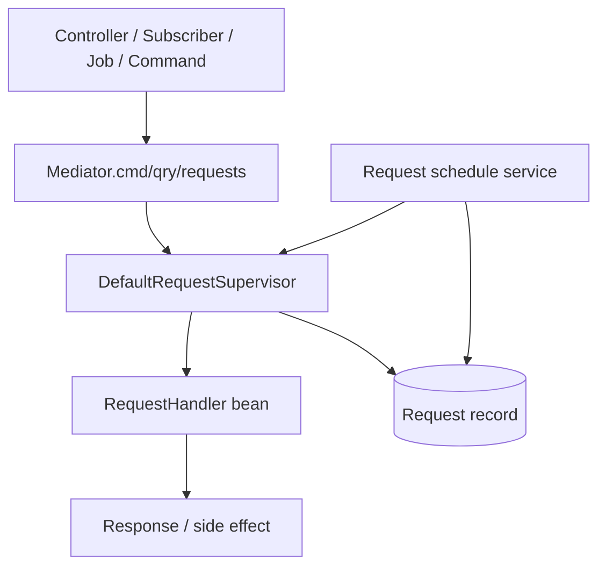
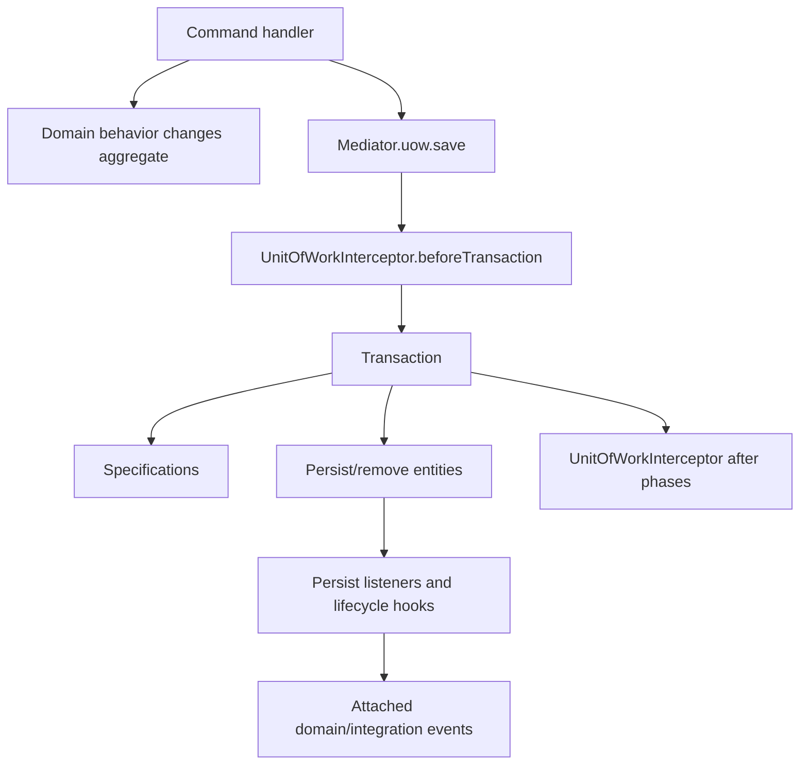
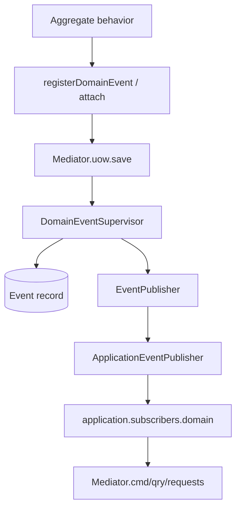

# cap4k Runtime Support And Integration Map

Date: 2026-05-11

This file maps the runtime support that generated or hand-written business code relies on.

## Starter Auto-Configuration

`cap4k-ddd-starter` imports these runtime families through Spring Boot auto-configuration:

| Family | Main capability |
|---|---|
| Mediator | Configures the global `Mediator` and Spring application context |
| Request | Request supervisor, request records, scheduling/compensation/archive |
| JPA repository / UoW | Repository supervisor, aggregate supervisor, factory supervisor, UoW, persist listeners, specifications |
| Domain event | Domain event supervisor, event records, event publisher, event subscribers, event schedule service |
| Integration event | Integration event supervisor, UoW interceptor, HTTP/RabbitMQ/RocketMQ adapters |
| Domain service | Domain service supervisor |
| ID policy | UUID7 and optional snowflake-long strategies |
| JDBC locker | Distributed lock implementation and reentrant aspect |
| Saga | Saga supervisor and schedule service |
| Arch info | Optional `/cap4k/arch-info` endpoint |
| Web context cleanup | Clears domain/UoW/event context after web request completion |

Business authoring should show which capability is being used instead of treating generated code as plain Spring CRUD.

## Main Runtime Switches

| Property | Default / behavior |
|---|---|
| `cap4k.ddd.application.jpa-uow.supportEntityInlinePersistListener` | `true`; enables `onCreate`/`onUpdate`/`onDelete` inline listener support |
| `cap4k.ddd.application.jpa-uow.supportValueObjectExistsCheckOnSave` | `true` |
| `cap4k.ddd.application.jpa-uow.retrieveCountWarnThreshold` | `3000` |
| `cap4k.ddd.domain.event.eventScanPackage` | empty by default; scan range for domain and integration events |
| `cap4k.ddd.domain.event.publisherThreadPoolSize` | `4` |
| `cap4k.ddd.integration.event.http.publishThreadPoolSize` | `4` |
| `cap4k.ddd.arch-info.enabled` | disabled unless explicitly true |

Schedule properties exist for request/domain-event/saga compensation and archive jobs. Authoring examples should keep defaults unless they demonstrate scheduling.

## Request Flow

`RequestSupervisor` supports:

- `send`;
- `async`;
- `schedule`;
- `delay`;
- `result`.

Commands, queries, and client/cli requests all ride on request params and handlers. The framework records requests for scheduled/async compensation through JPA request records.



## Saga Runtime Flow

`SagaSupervisor` supports:

- `send`;
- `async`;
- `schedule`;
- `delay`;
- `result`.

Saga execution is persisted in `__saga` and `__saga_process` when the JPA Saga module is used. The runtime is a replay/retry coordinator, not a first-class "wait for external callback and resume at this step" state machine.

```mermaid
flowchart TD
    Caller[Command / Job / System operation] --> SagaSupervisor[SagaSupervisor]
    SagaSupervisor --> SagaRecord[(Saga record)]
    SagaSupervisor --> Handler[SagaHandler]
    Handler --> Process[execProcess processCode request]
    Process --> RequestSupervisor[RequestSupervisor]
    RequestSupervisor --> RequestHandler[Command / Query / Request handler]
    Process --> SagaProcess[(Saga process record)]
    Schedule[JpaSagaScheduleService] --> SagaManager[SagaManager.resume]
    Console[/cap4k/console/saga/retry] --> SagaManagerRetry[SagaManager.retry]
    SagaManager --> SagaSupervisor
    SagaManagerRetry --> SagaSupervisor
```

Runtime semantics confirmed from `DefaultSagaSupervisor` and the JPA Saga implementation:

- `send` creates a saga record and executes the handler immediately.
- `schedule` creates a saga record and schedules execution; records scheduled within the local threshold are marked executing immediately.
- `async` is the `SagaSupervisor` default `schedule(request, LocalDateTime.now())` path and returns the saga ID.
- `delay` is the `SagaSupervisor` default `schedule(request, LocalDateTime.now().plus(delay))` path and returns the saga ID.
- `SagaHandler.execProcess(processCode, request)` executes a child request through `RequestSupervisor`.
- an `EXECUTED` saga process is skipped on replay and its cached result is returned.
- if a saga process throws, the process and saga are recorded as `EXCEPTION`.
- `retry(uuid)` loads the persisted saga and re-enters execution directly through the retry path `internalSend(param, saga)`, so already executed process codes are skipped during the replayed handler run.
- scheduled compensation scans valid sagas by `nextTryTime` and calls `SagaManager.resume`.
- `resume(saga, minNextTryTime)` first advances saga timing/state with `beginSaga(...)`, saves the saga, validates it, and only reschedules execution when `saga.isExecuting` is still true.
- if the saga is no longer runnable after `resume` advances state, `resume` stops after persisting state and does not re-enter the handler.
- `/cap4k/console/saga/retry?uuid=...` calls `SagaManager.retry(uuid)` for manual/operator retry.

Runtime consequences of this implementation:

- retry restarts the saga handler from the persisted saga param rather than resuming from a separate step pointer.
- scheduled resume advances retry timing/state first and may stop without re-entering the handler when the saga is no longer executing.
- successful `execProcess` calls are sticky by `processCode`; later retries return the cached result instead of re-sending the child request.
- failed `execProcess` calls persist exception state and rethrow; the next direct retry can run the handler again, while scheduled resume only does so when the saga remains executing after its state update.
- whole-saga recovery is exposed through scheduled `resume` and manual `retry(uuid)`; there is no separate callback-step API in this runtime surface.

## Unit Of Work Flow



Key points:

- factories enlist new aggregate roots into UoW;
- command handlers should not rely on manual transaction annotations as the primary write boundary;
- specifications and event publication are connected to UoW execution.

## Domain Event Flow

Domain events are domain facts emitted from aggregate behavior. They are recorded/published by the domain event supervisor and consumed through event subscribers.



`@AutoRequest` can convert a domain event to a request and send it through the request supervisor. `@AutoRelease` can convert a domain event to an integration event.

## Integration Event Flow

Integration events represent cross-boundary messages. They can be attached to UoW or published directly through the integration event supervisor.

```mermaid
flowchart TD
    Producer[Business code / AutoRelease] --> Attach[Mediator.events.attach or publish]
    Attach --> IntegrationSupervisor[IntegrationEventSupervisor]
    IntegrationSupervisor --> EventRecord[(Event record)]
    EventRecord --> EventPublisher[DefaultEventPublisher]
    EventPublisher --> Adapter{Integration adapter}
    Adapter --> Http[HTTP callbacks]
    Adapter --> Rabbit[RabbitMQ]
    Adapter --> Rocket[RocketMQ]
    Http --> ConsumerEndpoint[/cap4k/integration-event/http/consume]
    ConsumerEndpoint --> SubscriberManager[EventSubscriberManager]
    SubscriberManager --> Subscriber[application.subscribers.integration]
    Subscriber --> FollowUp[Mediator.cmd/qry/requests]
```

Core annotations/classes:

- `@IntegrationEvent(value = "...", subscriber = "...")`;
- `IntegrationEventSupervisor.attach`;
- `IntegrationEventSupervisor.publish`;
- `EventSubscriber<Event>`;
- `IntegrationEventPublisher`;
- `IntegrationEventInterceptorManager`.

Runtime bridge:

- `EventSubscriberManager` scans integration event classes and registers an in-process subscriber that republishes the payload through Spring `ApplicationEventPublisher`;
- generated inbound subscriber skeletons use Spring `@EventListener`, so HTTP/Rabbit/Rocket consumption reaches `application.subscribers.integration` through this bridge;
- handwritten subscribers can still implement `EventSubscriber<Event>` directly when a project wants the lower-level runtime contract.

HTTP adapter endpoints:

| Endpoint | Purpose |
|---|---|
| `/cap4k/integration-event/http/consume?event=...&uuid=...` | Consume inbound event payload |
| `/cap4k/integration-event/http/subscribe?event=...&subscriber=...` | Register subscriber callback |
| `/cap4k/integration-event/http/unsubscribe?event=...&subscriber=...` | Remove subscriber |
| `/cap4k/integration-event/http/events` | List events |
| `/cap4k/integration-event/http/subscribers?event=...` | List subscribers |

If `ddd-integration-event-http-jpa` is present, HTTP subscriber registration is backed by a JPA table. Local examples need only the minimal compatible DDL, adapted to H2 when H2 is used.

## Callback Main Path Example

For a media-processing callback simulation:

1. External boundary posts an integration event payload to `/cap4k/integration-event/http/consume`.
2. HTTP adapter deserializes and dispatches the integration event.
3. `application.subscribers.integration` subscriber receives the event.
4. Subscriber sends a command such as `MarkMediaProcessingSucceededCmd`.
5. Command handler loads and changes the aggregate, then calls `Mediator.uow.save()`.
6. Aggregate emits a domain event such as media-processing succeeded.
7. Domain subscriber performs follow-up orchestration, such as sending `PublishContentCmd`.

This is not pretending an external callback is a domain event. The external input remains an integration event, then application logic translates it into domain state changes.

## Event Contract Sharing

Cross-service integration event classes can be shared by copy/paste or by generation from a shared design contract. In cap4k, the stronger long-term fit is to generate event contracts from design so each service owns its local code while sharing the same event shape.

Package-name consistency may be useful for exact serializer compatibility, but the authoring rule should be explicit per transport. The stable contract is event name, schema, and serialization behavior, not a blanket dependency on another service's application module.

## Framework Tables

Runtime families with JPA persistence need corresponding schema:

- request records;
- event records;
- saga records if saga is used;
- integration event HTTP subscriber registry when HTTP-JPA adapter is used;
- distributed locker when JDBC locker is used.

Example projects should include only the required subset. For H2 local examples, SQL should be translated to H2-compatible syntax while preserving required columns and semantics.

## Interceptor Extension Points

Business/framework extension points include:

- `RequestInterceptor`;
- `UnitOfWorkInterceptor`;
- `EventInterceptor`;
- `EventMessageInterceptor`;
- `IntegrationEventInterceptor`;
- `PersistListener`;
- `Specification`.

Authoring should mention these as extension points, but not force first-version examples to demonstrate all of them.
